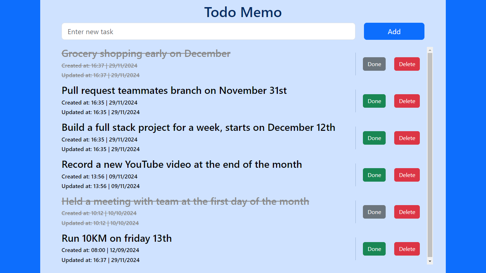

# Todo Memo App
## Tech Stack used
### Language
* Javascript
### Frontend
* Vite + React
* Bootstrap
* React context API
### Backend
* Node + Express
* MySQL
* Sequelize (for ORM)
* Swagger (for documentation)
## Screenshots

